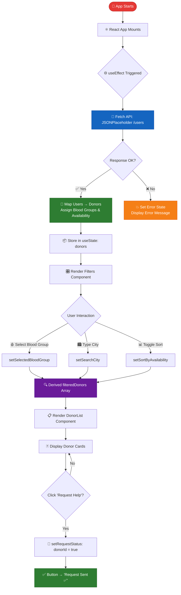
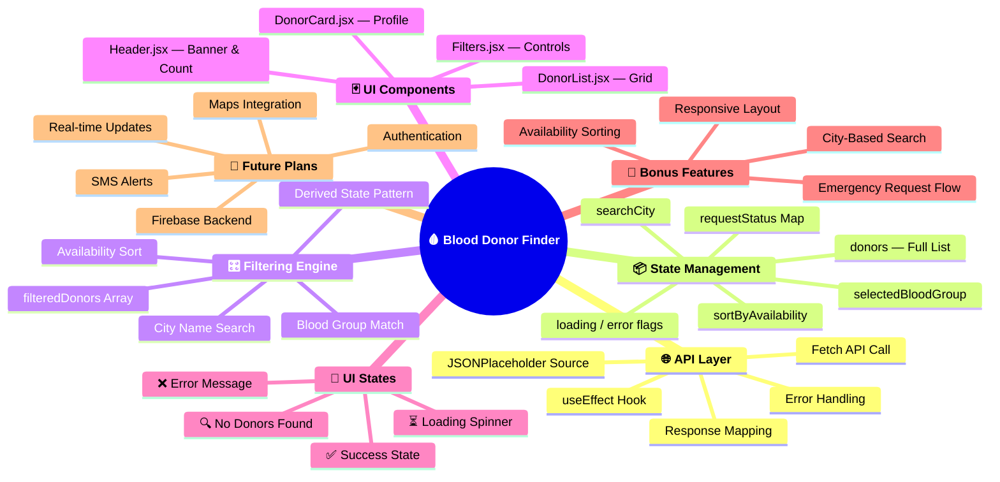
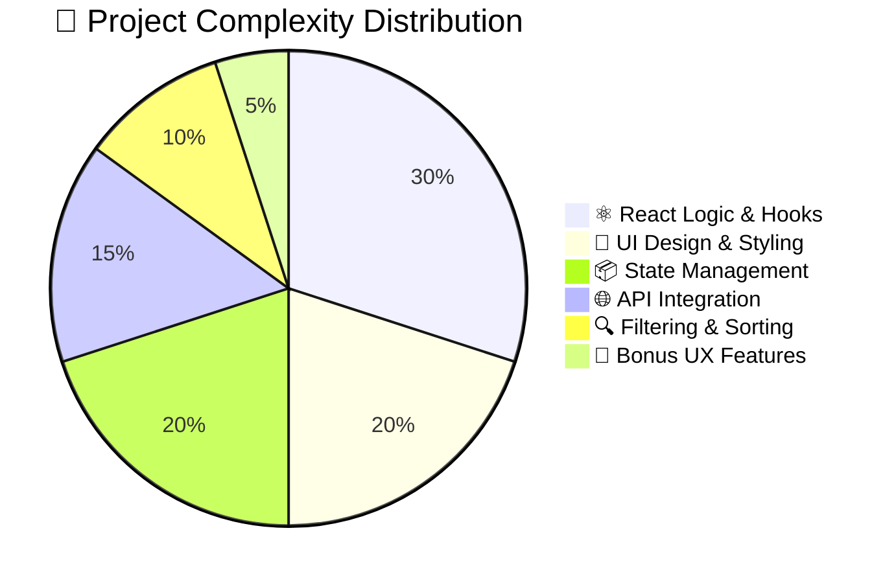
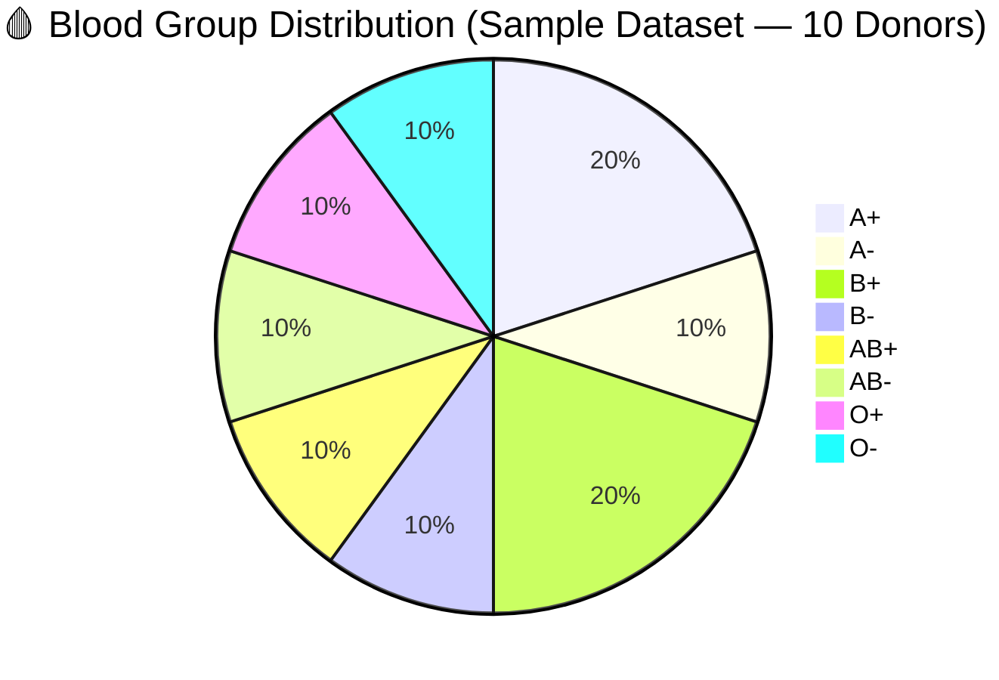
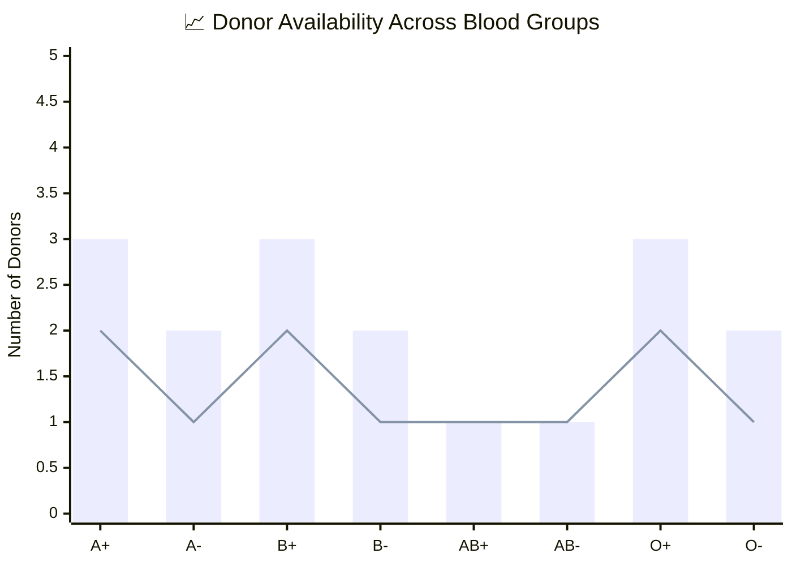
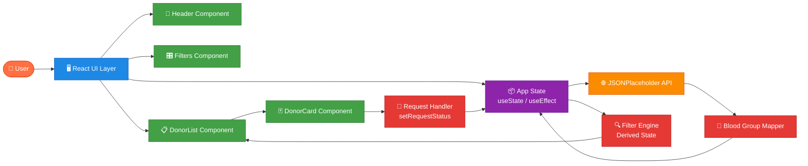
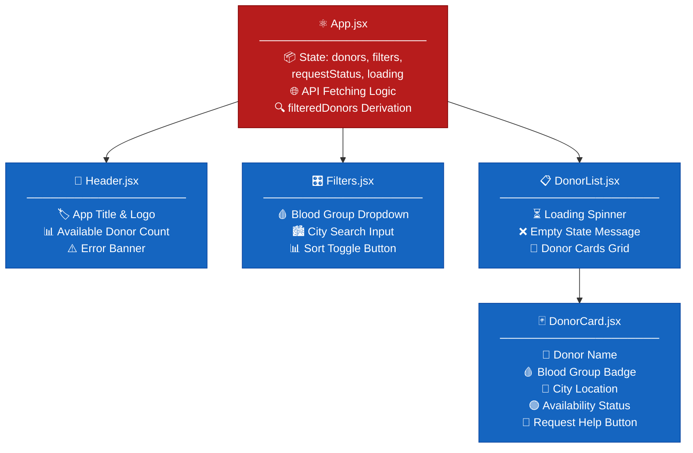
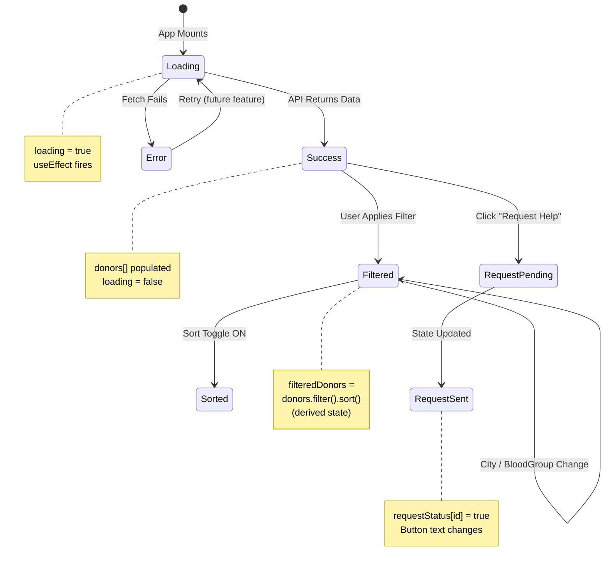
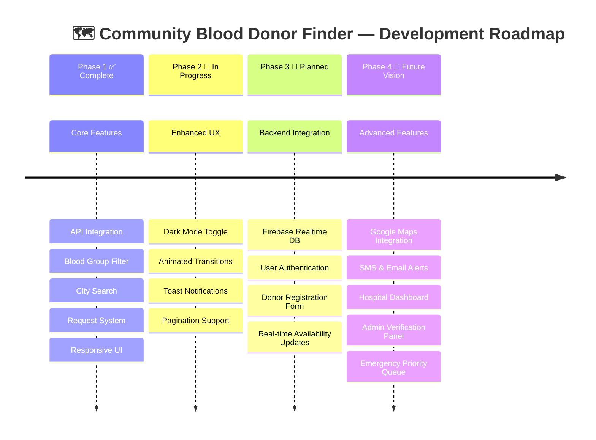

<div align="center">


<br/>


<br/><br/>

> ### *"Every second counts. Every donor matters. Every life is worth saving."*
> 🚑 A React-powered emergency blood donor discovery platform built to save lives through technology.

<br/>

```
╔══════════════════════════════════════════════════════════════════╗
║                                                                  ║
║         🩸   C O M M U N I T Y   B L O O D   F I N D E R  🩸   ║
║                                                                  ║
║         Search  ●  Filter  ●  Connect  ●  Request               ║
║                                                                  ║
║              ❤️  Every Drop Counts  ❤️                          ║
║                                                                  ║
╚══════════════════════════════════════════════════════════════════╝
```

---

[🌟 Features](#-core-features) • [🚀 Quick Start](#-installation--setup) • [🗺️ Flowchart](#️-system-architecture--flowchart) • [📊 Charts](#-project-analytics) • [🧠 Mind Map](#-mind-map) • [📁 Structure](#-project-structure) • [🛠️ Tech Stack](#️-tech-stack) • [🔮 Roadmap](#-future-roadmap)

</div>

---

## 📌 Table of Contents

- [🎯 Problem Statement](#-problem-statement)
- [🌟 Core Features](#-core-features)
- [🗺️ System Architecture & Flowchart](#️-system-architecture--flowchart)
- [🧠 Mind Map](#-mind-map)
- [📊 Project Analytics](#-project-analytics)
- [📈 Architecture Diagram](#-architecture-diagram)
- [⚛️ React Concepts Used](#️-react-concepts-deep-dive)
- [📁 Project Structure](#-project-structure)
- [🛠️ Tech Stack](#️-tech-stack)
- [🚀 Installation & Setup](#-installation--setup)
- [🖥️ Component Breakdown](#️-component-breakdown)
- [🧪 State Management Guide](#-state-management-guide)
- [🎨 UI States Explained](#-ui-states-explained)
- [✨ Bonus Features](#-bonus-features-implemented)
- [🔮 Future Roadmap](#-future-roadmap)
- [🎓 Learning Outcomes](#-learning-outcomes)
- [👨‍💻 Author](#-author)

---

## 🎯 Problem Statement

<table>
<tr>
<td>

### ❗ The Real-World Crisis

Every **2 seconds**, someone in the world needs blood.  
Hospitals and patients often struggle to find **the right blood donor at the right time** during emergencies.  
Manual searching is **slow, inefficient, and costs lives**.

</td>
<td>

### 💡 Our Solution

A **smart donor discovery platform** built with React that:

- 🔍 Finds donors **instantly** by blood group
- 📍 Searches donors **by city location**
- 📊 Shows **real-time availability**
- 🚨 Sends **emergency help requests** in one click
- 📈 Displays **available donor counts** dynamically

</td>
</tr>
</table>

> [!IMPORTANT]  
> This application bridges the gap between blood donors and patients during critical emergencies, demonstrating how modern web technology can create meaningful real-world impact.

---

## 🌟 Core Features

<table>
<thead>
<tr>
<th>Feature</th>
<th>Description</th>
<th>Status</th>
</tr>
</thead>
<tbody>
<tr>
<td>🌐 <strong>API Integration</strong></td>
<td>Fetches donor data from JSONPlaceholder API using <code>useEffect</code> on mount</td>
<td>✅ Live</td>
</tr>
<tr>
<td>🩸 <strong>Blood Group Filter</strong></td>
<td>Filter donors by A+, A−, B+, B−, AB+, AB−, O+, O− via dropdown</td>
<td>✅ Live</td>
</tr>
<tr>
<td>🔍 <strong>City Search</strong></td>
<td>Real-time search donors by city name (case-insensitive)</td>
<td>✅ Live</td>
</tr>
<tr>
<td>📊 <strong>Sort by Availability</strong></td>
<td>Sort donors so available ones always appear first</td>
<td>✅ Live</td>
</tr>
<tr>
<td>🃏 <strong>Donor Cards</strong></td>
<td>Beautiful cards showing name, blood group, city, availability badge</td>
<td>✅ Live</td>
</tr>
<tr>
<td>🚨 <strong>Request System</strong></td>
<td>One-click "Request Help" → "Request Sent ✅" status toggle</td>
<td>✅ Live</td>
</tr>
<tr>
<td>⏳ <strong>Loading Spinner</strong></td>
<td>Elegant loading state while data is being fetched</td>
<td>✅ Live</td>
</tr>
<tr>
<td>❌ <strong>Empty State</strong></td>
<td>"No donors found" message when filters return nothing</td>
<td>✅ Live</td>
</tr>
<tr>
<td>📈 <strong>Donor Counter</strong></td>
<td>Live count of available donors based on active filters</td>
<td>✅ Live</td>
</tr>
<tr>
<td>📱 <strong>Responsive Design</strong></td>
<td>Fully mobile-friendly layout across all device sizes</td>
<td>✅ Live</td>
</tr>
</tbody>
</table>

---

## 🗺️ System Architecture & Flowchart



---

## 🧠 Mind Map



---

## 📊 Project Analytics







---

## 📈 Architecture Diagram



---

## ⚛️ React Concepts Deep Dive

<table>
<tr>
<th>🔥 Hook / Concept</th>
<th>📌 Where Used</th>
<th>💡 What It Does</th>
</tr>
<tr>
<td><code>useState([])</code></td>
<td><code>App.jsx</code></td>
<td>Stores the full donors array fetched from API</td>
</tr>
<tr>
<td><code>useState('')</code></td>
<td><code>App.jsx</code></td>
<td>Tracks selected blood group and city search input</td>
</tr>
<tr>
<td><code>useState(false)</code></td>
<td><code>App.jsx</code></td>
<td>Toggle state for sort-by-availability feature</td>
</tr>
<tr>
<td><code>useState({})</code></td>
<td><code>App.jsx</code></td>
<td>Maps <code>donorId → boolean</code> for request status tracking</td>
</tr>
<tr>
<td><code>useEffect(fn, [])</code></td>
<td><code>App.jsx</code></td>
<td>Triggers API fetch on component mount (once)</td>
</tr>
<tr>
<td><strong>Derived State</strong></td>
<td><code>filteredDonors</code></td>
<td>Computes filtered+sorted list without extra useState</td>
</tr>
<tr>
<td><strong>Conditional Rendering</strong></td>
<td><code>DonorList.jsx</code>, <code>Header.jsx</code></td>
<td>Renders spinner, error, empty, or card list based on state</td>
</tr>
<tr>
<td><strong>Prop Drilling</strong></td>
<td>App → Filters → DonorList → DonorCard</td>
<td>Passes state and handlers cleanly down the tree</td>
</tr>
<tr>
<td><strong>Event Handling</strong></td>
<td><code>handleRequest()</code>, filter onChange</td>
<td>Updates state on user interaction</td>
</tr>
<tr>
<td><strong>Array Methods</strong></td>
<td><code>.filter()</code>, <code>.sort()</code>, <code>.map()</code></td>
<td>Core logic for filtering, sorting, and rendering donors</td>
</tr>
</table>

---

## 📁 Project Structure

```
🗂️ community-blood-donor-finder/
│
├── 📄 index.html                    ← HTML entry point
├── 📦 package.json                  ← Dependencies & scripts
├── ⚙️ vite.config.js                ← Vite bundler config
├── 🔒 .gitignore                    ← Git ignore rules
│
├── 📂 src/
│   ├── ⚛️  main.jsx                 ← App bootstrap (ReactDOM.render)
│   ├── 🏗️  App.jsx                  ← Root component + all state logic
│   ├── 🎨  index.css                ← Global styles & design system
│   │
│   └── 📂 components/
│       ├── 🏥  Header.jsx           ← Banner, title, donor count badge
│       ├── 🎛️  Filters.jsx          ← Blood group dropdown, city search, sort
│       ├── 📋  DonorList.jsx        ← Grid/list of donor cards + UI states
│       └── 🃏  DonorCard.jsx        ← Individual donor profile + request button
│
├── 📂 dist/                         ← Production build output (auto-generated)
└── 📂 node_modules/                 ← Installed dependencies
```

---

## 🛠️ Tech Stack

<table>
<thead>
<tr>
<th>Technology</th>
<th>Version</th>
<th>Role</th>
<th>Why Chosen</th>
</tr>
</thead>
<tbody>
<tr>
<td>⚛️ <strong>React</strong></td>
<td>18.2.0</td>
<td>Frontend Framework</td>
<td>Component-based, reactive UI with hooks</td>
</tr>
<tr>
<td>⚡ <strong>Vite</strong></td>
<td>5.0.0</td>
<td>Build Tool</td>
<td>Lightning-fast HMR and build times</td>
</tr>
<tr>
<td>🟨 <strong>JavaScript</strong></td>
<td>ES6+</td>
<td>Logic & Functionality</td>
<td>Modern syntax: async/await, destructuring, arrow functions</td>
</tr>
<tr>
<td>🎨 <strong>CSS3</strong></td>
<td>Vanilla</td>
<td>Styling</td>
<td>Full control over design, no framework overhead</td>
</tr>
<tr>
<td>🌐 <strong>JSONPlaceholder</strong></td>
<td>API</td>
<td>Mock Backend</td>
<td>Free, reliable REST API for prototyping</td>
</tr>
<tr>
<td>🎯 <strong>Lucide React</strong></td>
<td>0.292.0</td>
<td>Icon Library</td>
<td>Clean, consistent SVG icons for better UX</td>
</tr>
</tbody>
</table>

---

## 🚀 Installation & Setup

### Prerequisites

Make sure you have the following installed:

| Tool | Version | Download |
|------|---------|----------|
| Node.js | ≥ 18.x | [nodejs.org](https://nodejs.org) |
| npm | ≥ 9.x | Bundled with Node.js |
| Git | Latest | [git-scm.com](https://git-scm.com) |

### Step-by-Step Guide

```bash
# 1️⃣  Clone the repository
git clone https://github.com/your-username/community-blood-donor-finder.git

# 2️⃣  Navigate into the project directory
cd community-blood-donor-finder

# 3️⃣  Install all dependencies
npm install

# 4️⃣  Start the development server
npm run dev

# 5️⃣  Open your browser and visit
#     ➜  http://localhost:5173
```

> [!TIP]  
> Run `npm run build` to create a production-ready bundle in the `dist/` folder.  
> Run `npm run preview` to locally preview the production build.

---

## 🖥️ Component Breakdown



---

## 🧪 State Management Guide



---

## 🎨 UI States Explained

| 🖥️ State | 🔍 Trigger | 👁️ What User Sees |
|-----------|-----------|-------------------|
| ⏳ **Loading** | `loading === true` | Animated spinner with "Fetching donors..." |
| ✅ **Success** | Data loads successfully | Grid of donor cards with filters active |
| ❌ **Error** | `error !== null` | Red error banner with error message |
| 🔍 **No Donors** | Filters return empty array | "No donors found" illustration + message |
| 📊 **Filtered** | User selects blood group or types city | Subset of cards matching criteria |
| 🚨 **Request Sent** | User clicks "Request Help" | Button changes to "Request Sent ✅" (green) |

---

## ✨ Bonus Features Implemented

> [!NOTE]  
> These advanced features go beyond the base requirements and demonstrate production-level thinking.

| 🌟 Bonus Feature | 🔧 Implementation | 💡 UX Impact |
|-----------------|------------------|--------------|
| 🏙️ **Search by City** | `searchCity` state + `.filter()` on `donor.address.city` | Find local donors instantly |
| 📊 **Sort by Availability** | Toggle `sortByAvailability` + `.sort()` comparator | Available donors always appear first |
| 📈 **Live Donor Counter** | `filteredAvailableCount` derived from filtered array | Always up-to-date count shown in Header |
| 🎨 **Availability Badge** | Conditional className on `isAvailable` flag | Instant visual scan of who's ready |
| ⚛️ **Component Architecture** | Split into Header, Filters, DonorList, DonorCard | Clean, scalable, maintainable codebase |

---

## 🔮 Future Roadmap



---

## 🎓 Learning Outcomes

This project is a comprehensive exercise in **production-level React development**.

<table>
<tr>
<th>🔥 Core React Skills</th>
<th>💼 Industry-Level Skills</th>
</tr>
<tr>
<td>

- ✅ `useState` for complex state shapes
- ✅ `useEffect` for side effects & API calls
- ✅ Derived state (no unnecessary state)
- ✅ Conditional rendering patterns
- ✅ Dynamic filtering logic
- ✅ Sorting with `.sort()` comparator functions
- ✅ Prop drilling across component tree
- ✅ Event handling & state updates
- ✅ Array transformation: `.map()`, `.filter()`, `.sort()`
- ✅ Async/Await + try/catch/finally

</td>
<td>

- ✅ Production-ready component architecture
- ✅ Scalable state management thinking
- ✅ Real-world problem solving with code
- ✅ UX-first development mindset
- ✅ Clean, reusable component design
- ✅ API error handling & graceful degradation
- ✅ Loading state management
- ✅ Data transformation from API to UI
- ✅ Separation of concerns
- ✅ Modern tooling with Vite + ESLint

</td>
</tr>
</table>

---

## 💬 App API Reference

| Endpoint | Method | Description |
|---------|--------|-------------|
| `https://jsonplaceholder.typicode.com/users` | `GET` | Fetch 10 mock users → mapped as donors |

**Data Transformation:**
```javascript
// Raw API user → Enhanced Donor Object
{
  id: 1,
  name: "Leanne Graham",
  address: { city: "Gwenborough" },
  // ↓ Added locally:
  bloodGroup: "A+",       // Cycled from BLOOD_GROUPS array
  isAvailable: true       // index % 3 !== 0
}
```

---

## 🌐 Supported Blood Groups

```
╔═══╦═══╦═══╦═══╦════╦════╦═══╦═══╗
║ A+║ A−║ B+║ B−║ AB+║ AB−║ O+║ O−║
╚═══╩═══╩═══╩═══╩════╩════╩═══╩═══╝
       All 8 major blood groups supported
```

---

## 🤝 Contributing

Contributions are warmly welcome! Here's how:

```bash
# 1. Fork the project
# 2. Create your feature branch
git checkout -b feature/amazing-feature

# 3. Commit your changes
git commit -m "✨ Add amazing feature"

# 4. Push to your branch
git push origin feature/amazing-feature

# 5. Open a Pull Request 🚀
```

> [!IMPORTANT]  
> Please make sure to follow the existing code style, use meaningful commit messages, and add comments for complex logic.

---

## 📜 License

```
MIT License

Copyright (c) 2026 Community Blood Donor Finder

Permission is hereby granted, free of charge, to any person obtaining a copy
of this software... to use, copy, modify, merge, publish, distribute.

THE SOFTWARE IS PROVIDED "AS IS", WITHOUT WARRANTY OF ANY KIND.
```

---

## 👩‍💻 Author

<div align="center">

### 🚀 Built with Passion & Purpose


<br/>

| | |
|:---:|:---|
| 🏆 | **Smarani Ekkaladevi** |
| 💻 | **Professional Competitive Programmer** |
| ⚛️ | **React Developer** |
| 🧠 | **Problem Solver** |
| 🚀 | **Full Stack Enthusiast** |
| ❤️ | **Social Impact Builder — Code for Good** |

<br/>


</div>

---

## 🌟 Support & Spread the Word

<div align="center">

If this project helped you or inspired you, show your support! 💖

[](https://github.com/your-username/community-blood-donor-finder)
[](https://github.com/your-username/community-blood-donor-finder/fork)
[](https://github.com/your-username/community-blood-donor-finder)

</div>

---

<div align="center">

```
╔══════════════════════════════════════════════════════════════╗
║                                                              ║
║     🩸  Every Drop Counts                                    ║
║     ❤️  Every Donor Matters                                  ║
║     🚑  Every Second Saves a Life                            ║
║                                                              ║
║          Thank You for Building for Good  🙏                ║
║                                                              ║
╚══════════════════════════════════════════════════════════════╝
```


---

*Made with ❤️ and React · Powered by ⚡ Vite · Designed to Save Lives 🩸*

</div>
# Blood_Donor_Finder

